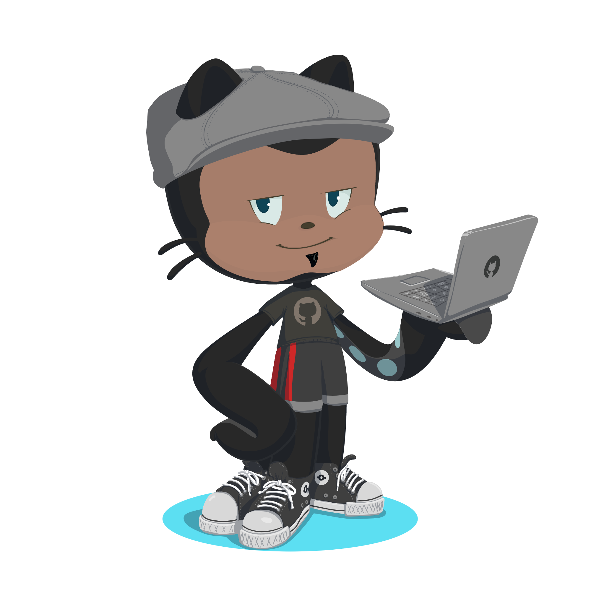

<h1 align='left'>Andre Felipe dos Santos</h1>
<h3 align='left'>{  ... designer, webDeveloper  }</h3>

  

    

      ❤️ "O por que" - Apaixonado por tecnologia desde jovem ( 1995 )
    

    

      🎯 "O como" - Visão de design centrada em desenvolver soluções eficientes
    

    

      👨🏾‍💻 "O onde" - Empreendedor em transição de carreira para Desenvolvedor web full stack
    

    

      ⛵️ "O lema" - `"Não importa a direção do vento e sim a posição das velas"`
    
    
  

##

<h3 align="center"> Stacks Developer </h3>

 
  
  
  
  
  
  
  
  
  
  
  

  
  
  
  
  
  
  
  
  

##

 

  <a href="https://github.com/afstudiox">
  

##

 
  
  
  
  

